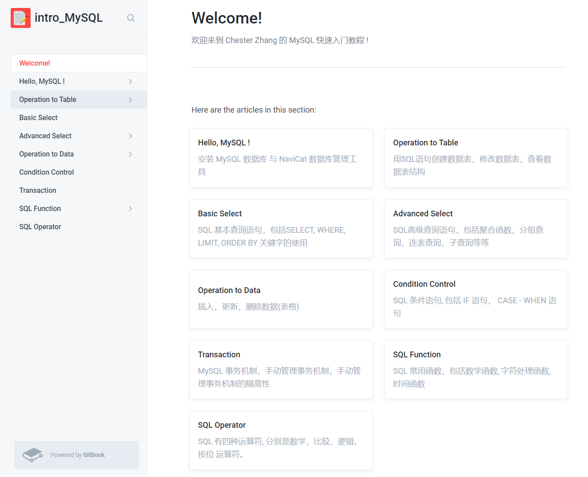

## 欢迎来到 Chester Zhang 的 MySQL快速入门 代码仓库
####
也欢迎访问 [我的配套 GitBook 图文教程](https://chesterzhang666.gitbook.io/intro-mysql/)
###

###

<table>
<thead>
  <tr>
    <th>章节</th>
    <th>说明</th>
    <th>GitBook 图文教程</th>
    <th>源码</th>
  </tr>
</thead>
<tbody>
  <tr>
    <td>Hello, MySQL</td>
    <td>MySQL 与 Navicat安装</td>
    <td>Hello, MySQL[待完成]</td>
    <td>无</td>
  </tr>
  <tr>
    <td>Operation to Table</td>
    <td>创建, 修改数据表</td>
    <td><a href="https://chesterzhang666.gitbook.io/intro-mysql/operation-to-table" target="_blank" rel="noopener noreferrer">Operation to Table[已完成]</a></td>
    <td><a href="https://github.com/chesterzhang/intro_MySQL/tree/zhc_dev/operation_to_table" target="_blank" rel="noopener noreferrer">已完成</a></td>
  </tr>
  <tr>
    <td>Basic Select </td>
    <td>基本查询语句,  FROM, WHERE, SELECT, ORDER BY, LIMIT的用法</td>
    <td><a href="https://chesterzhang666.gitbook.io/intro-mysql/basic-select-ji-ben-cha-xun" target="_blank" rel="noopener noreferrer">Basic Select 基本查询[已完成]</a></td>
    <td><a href="https://github.com/chesterzhang/intro_MySQL/tree/zhc_dev/basic_select" target="_blank" rel="noopener noreferrer">已完成</a></td>
  </tr>
  <tr>
    <td>Advanced Select</td>
    <td>高级查询语句, 聚合函数，分组查询，连表查询，子查询</td>
    <td><a href="https://chesterzhang666.gitbook.io/intro-mysql/advanced-select" target="_blank" rel="noopener noreferrer">Advanced Select[已完成]</a></td>
    <td><a href="https://github.com/chesterzhang/intro_MySQL/tree/zhc_dev/advanced_select" target="_blank" rel="noopener noreferrer">已完成</a></td>
  </tr>
  <tr>
    <td>Operation to Data</td>
    <td>插入，更新，删除数据</td>
    <td><a href="https://chesterzhang666.gitbook.io/intro-mysql/operation-to-data" target="_blank" rel="noopener noreferrer">Operation to Data[已完成]</a></td>
    <td><a href="https://github.com/chesterzhang/intro_MySQL/tree/zhc_dev/operation_to_data" target="_blank" rel="noopener noreferrer">已完成</a></td>
  </tr>
  <tr>
    <td>Condition Control</td>
    <td>SQL 条件语句, 包括 IF 语句， CASE - WHEN 语句</td>
    <td><a href="https://chesterzhang666.gitbook.io/intro-mysql/condition-control" target="_blank" rel="noopener noreferrer">Condition Control[已完成]</a></td>
    <td><a href="https://github.com/chesterzhang/intro_MySQL/tree/zhc_dev/condition_control" target="_blank" rel="noopener noreferrer">已完成</a></td>
  </tr>
  <tr>
    <td>Transaction</td>
    <td>什么是事务机制, 手动管理事务机制，事务机制的隔离性</td>
    <td><a href="https://chesterzhang666.gitbook.io/intro-mysql/transaction" target="_blank" rel="noopener noreferrer">Transaction[已完成]</a></td>
    <td><a href="https://github.com/chesterzhang/intro_MySQL/tree/zhc_dev/transaction" target="_blank" rel="noopener noreferrer">已完成</a></td>
  </tr>
  <tr>
    <td>SQL Function</td>
    <td>SQL 数学函数，字符处理函数，时间函数</td>
    <td><a href="https://chesterzhang666.gitbook.io/intro-mysql/sql-han-shu" target="_blank" rel="noopener noreferrer">SQL Function[已完成]</a></td>
    <td><a href="https://github.com/chesterzhang/intro_MySQL/tree/zhc_dev/sql_funtion" target="_blank" rel="noopener noreferrer">已完成</a></td>
  </tr>
  <tr>
    <td>SQL Operator</td>
    <td>SQL 数学，比较，逻辑，按位 运算符</td>
    <td><a href="https://chesterzhang666.gitbook.io/intro-mysql/sql-yun-suan-fu" target="_blank" rel="noopener noreferrer">SQL Operator[已完成]</a></td>
    <td>无</td>
  </tr>
</tbody>
</table>

